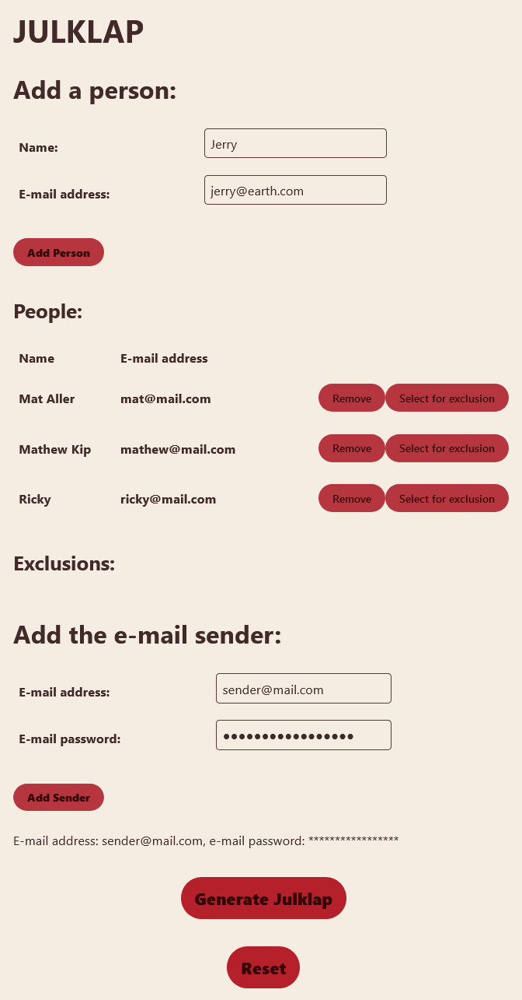

# Julklap (Secret Santa)

This is a cleaned-up version of some code I had laying around.

It allows you to generate a Julklap (Secret Santa) among a group of friends.

## Functionnalities

- Run a Secret Santa among a group of people.
- Mutual exclusions between participants: exclude couples from offering each other gifts.
- A nice webapp to create the Julklap mapping.

## Limitations

- For now, only single-chain mappings are possible (p1->p2->...p_n->p1). This eliminates some possibilities, so you can't have too many exclusions.
- You need to input a sender e-mail address and password.

## How it works

1. You need to decide on a sender address.
2. Generate an app password (look it up: quite easy for GMail).
3. Create a venv: `python -m venv venv` and `sourcee venv/bin/activate`
4. Install python requirements: `pip install -r requirements.txt`.
5. `export PYTHONPATH=src/main/python`
6. Launch the FastAPI back-end: `fastapi dev src/main/python/main.py` (in dev mode)
7. Launch the React front-end: `cd julklap-app` and `yarn start`
8. Go to http://localhost:3000 and create your Julklap !

## How it looks

## Dev

You will need a virtualenv where you will install the `dev-requirements.txt`.

### UT

For UTs, you should first `export PYTHONPATH=src/main/python`.
They are based on pytest, simply run `pytest`.

### Linting

No lint checking is implemented, but `black` auto-formatter is used.

### Typing

TODO.

### TODO

- Allow other types of mapping than single-chain (see limitations): graph theory.
- Add mypy type testing.
- Put everything in Dockerfiles for easy foolproof launching.
- Improve the front-end.
